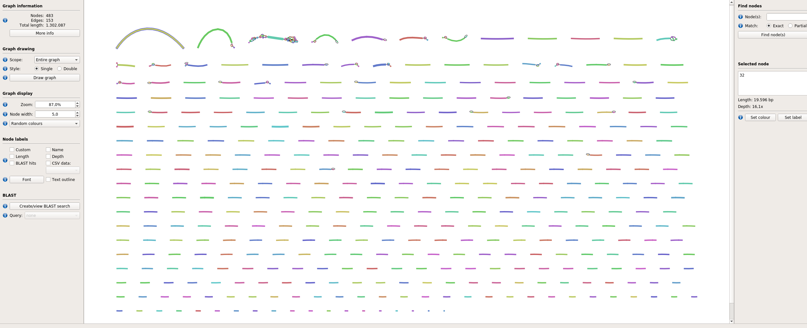
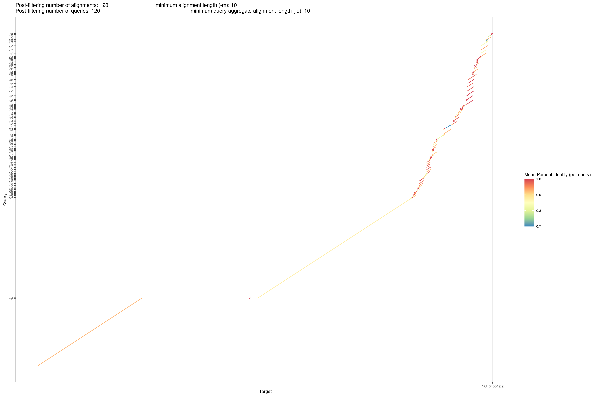

# Shasta parameters tuning - covid-19-bh20-assembly

**A de novo assembly of pulled down RNA sequenced on a nanopore device.**

A little temporary hack to remove uracils which shasta doesn't like in its default configuration.

<pre>zcat covid_update.fastq.gz | paste - - - - | tr ' ' '_' | tr -d '@' | tr 'U' 'T' | awk 'length($2) > 1500 { print ">"$1; print $2; }' > covid_update.1.5kb.UtoT.fasta</pre>

Modifying a little the default parameters

<pre>shasta-Linux-0.4.0 --input covid_update.1.5kb.UtoT.fasta --Reads.minReadLength 3460 --MarkerGraph.minCoverage 6 --MarkerGraph.maxCoverage 5000</pre>

we arrive to have a linear contig of nearly 20kbps, not enough:

The first BLAST match is <a href='https://www.ncbi.nlm.nih.gov/nucleotide/MT007544.1?report=genbank&log$=nuclalign&blast_rank=1&RID=8XU4NDS5016'>Severe acute respiratory syndrome coronavirus 2 isolate Australia/VIC01/2020, complete genome, MT007544.1</a> (query coverge 100%, identity 97.91%).

Forcing the tools to work at higher coverage (modifying its coverage thresholds)

<pre>shasta-Linux-0.4.0 --input covid_update.1.5kb.UtoT.fasta --Reads.minReadLength 3460 --MarkerGraph.minCoverage 10 --MarkerGraph.maxCoverage 5000 --MinHash.maxBucketSize 100 --MarkerGraph.lowCoverageThreshold 20 --MarkerGraph.highCoverageThreshold 2560 --MarkerGraph.edgeMarkerSkipThreshold 1000</pre>

we get a bigger conting (31.5 kbps), but also a little mess.

The mess is expected: the reason is that there is a very strong bias towards the end of the genome because this sequencing data was obtained from pulldown of polyA that it is at the end of the genome.

We still need to tune the pruning step and take conficence of the impact of this parameters tuning, but first we did an exploratory analysis. We mapped all the contigs on the reference (NC_045512.2) using minimap2 with its default parameters

<pre>
minimap2 NC_045512.2.fasta ShastaRun/Assembly.fasta > Assembly.paf
</pre>

and giving the resulting PAF into dotPlotly to check the results

<pre>
pafCoordsDotPlotly.R -i Assembly.paf -o out -s -t -m 10 -q 10 -s -p 15
</pre>

The scenario is similar as that of bandage: two big pieces, a hole in the middle (probably corrisponding to the drop in the sequencing coverage) and the mess due to the protocol bias.
