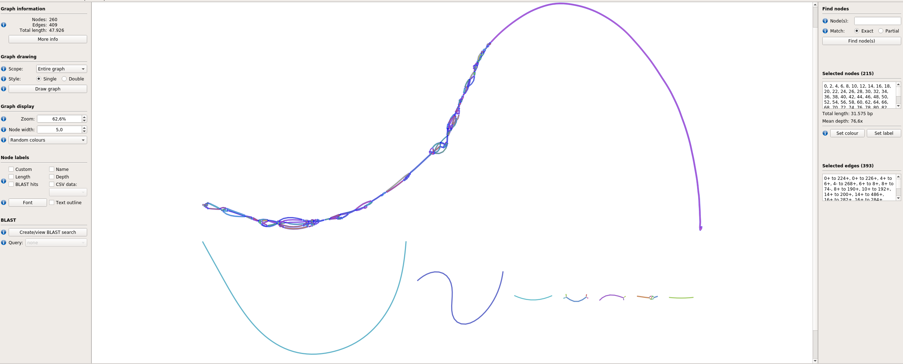
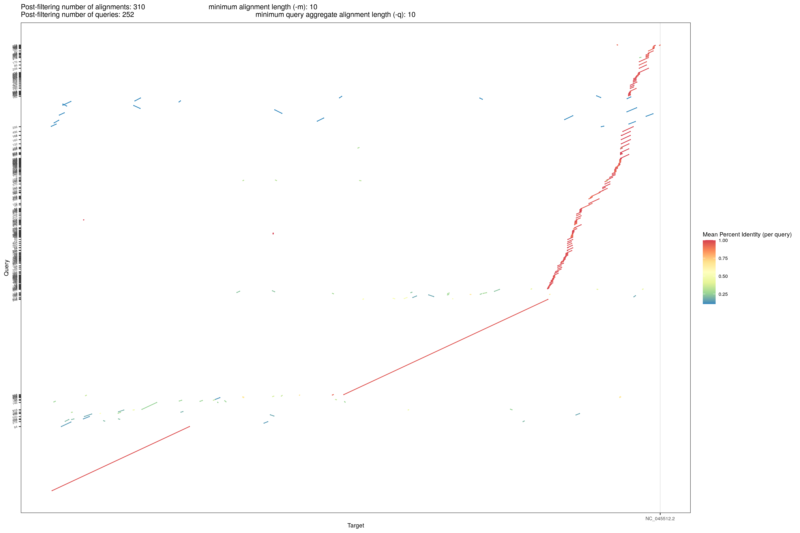
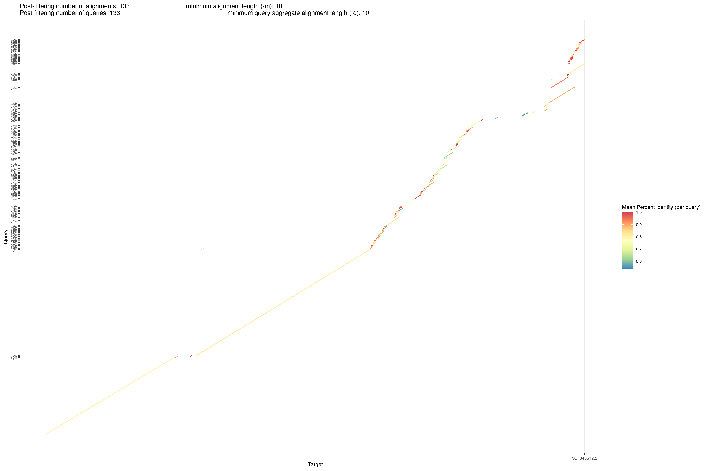
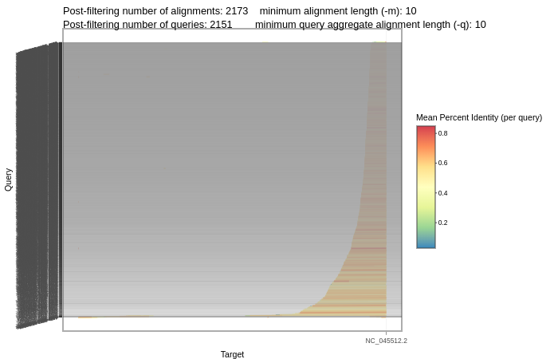
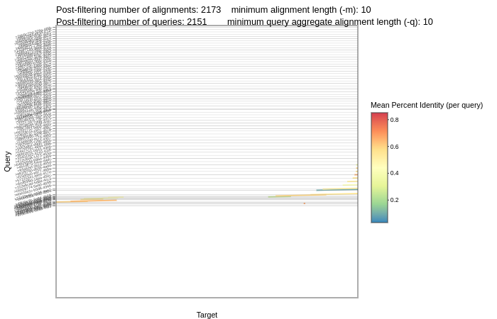
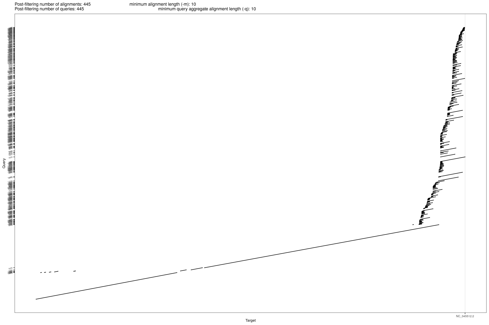
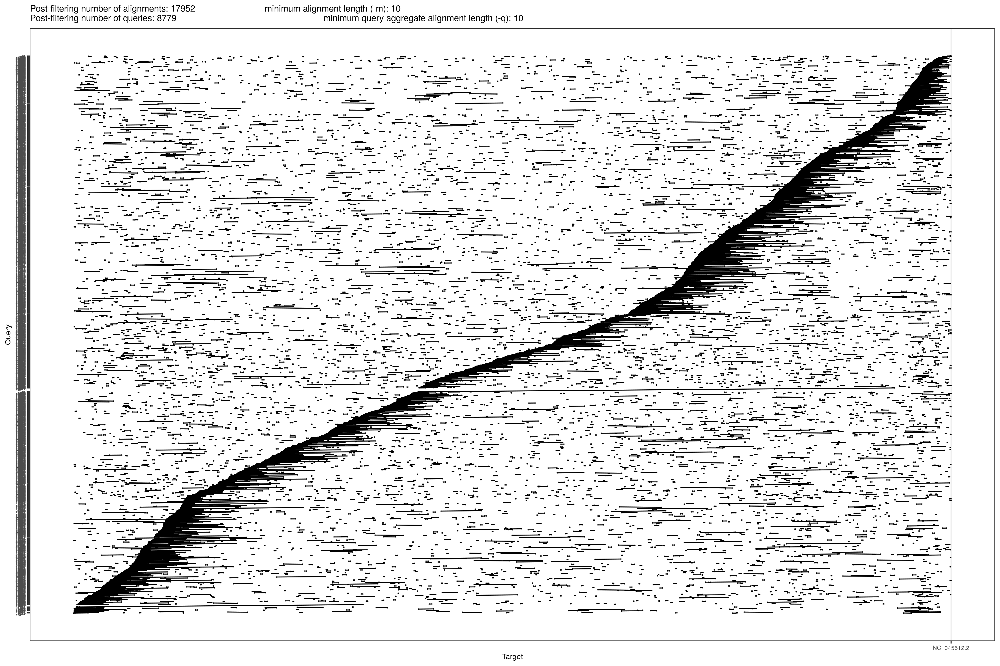

# Shasta parameters tuning - covid-19-bh20-assembly

**A de novo assembly of pulled down RNA sequenced on a nanopore device.**

A little temporary hack to remove uracils which shasta doesn't like in its default configuration.

<pre>zcat covid_update.fastq.gz | paste - - - - | tr ' ' '_' | tr -d '@' | tr 'U' 'T' | awk 'length($2) > 1500 { print ">"$1; print $2; }' > covid_update.1.5kb.UtoT.fasta</pre>

Modifying a little the default parameters

<pre>shasta-Linux-0.4.0 --input covid_update.1.5kb.UtoT.fasta --Reads.minReadLength 3460 --MarkerGraph.minCoverage 6 --MarkerGraph.maxCoverage 5000</pre>

we arrive to have a linear contig of nearly 20kbps, not enough:

The first BLAST match is <a href='https://www.ncbi.nlm.nih.gov/nucleotide/MT007544.1?report=genbank&log$=nuclalign&blast_rank=1&RID=8XU4NDS5016'>Severe acute respiratory syndrome coronavirus 2 isolate Australia/VIC01/2020, complete genome, MT007544.1</a> (query coverge 100%, identity 97.91%).

Forcing the tools to work at higher coverage (modifying its coverage thresholds)

<pre>shasta-Linux-0.4.0 --input covid_update.1.5kb.UtoT.fasta --Reads.minReadLength 3460 --MarkerGraph.minCoverage 10 --MarkerGraph.maxCoverage 5000 --MinHash.maxBucketSize 100 --MarkerGraph.lowCoverageThreshold 20 --MarkerGraph.highCoverageThreshold 2560 --MarkerGraph.edgeMarkerSkipThreshold 1000</pre>

we get a bigger conting (31.5 kbps), but also a little mess.

The mess is expected: the reason is that there is a very strong bias towards the end of the genome because this sequencing data was obtained from pulldown of polyA that it is at the end of the genome.

We still need to tune the pruning step and take conficence of the impact of this parameters tuning, but first we did an exploratory analysis. We mapped all the contigs on the reference (NC_045512.2) using minimap2 with its default parameters

<pre>
minimap2 NC_045512.2.fasta ShastaRun/Assembly.fasta > Assembly.paf
</pre>

and giving the resulting PAF into dotPlotly to check the results

<pre>
pafCoordsDotPlotly.R -i Assembly.paf -o out -s -t -m 10 -q 10 -s -p 15
</pre>

The scenario is similar as that of bandage: two big pieces, a hole in the middle (probably corrisponding to the drop in the sequencing coverage) and the mess due to the protocol bias.

To confirm that the "hole part" isn't assembled by Shasta, we forced minimap2 to map as many reads as possible

<pre>
minimap2 -k7 -w1 --sr --frag=yes -A6 -B2 -O12,32 -E2,1 -r50 -p.5 -N20 -f1000,5000 -n3 -m0 -s40 -g200 -2K50m --heap-sort=yes --secondary=no NC_045512.2.fasta ShastaRun/Assembly.fasta > Assembly.paf
pafCoordsDotPlotly.R -i Assembly.paf -o out -s -t -m 10 -q 10 -s -p 15
</pre>

and indeed we still got the hole    

We tried several parameters combinations to fill the hole, changing and/or decreasing the minimum coverage thresholds in the assemly step. Here some trials we did:

<pre>
shasta-Linux-0.4.0 --input covid_update.1.5kb.UtoT.fasta --Reads.minReadLength 3460 --MarkerGraph.minCoverage 3 --MarkerGraph.maxCoverage 5000 --MinHash.maxBucketSize 100 --MarkerGraph.lowCoverageThreshold 20 --MarkerGraph.highCoverageThreshold 2560 --MarkerGraph.edgeMarkerSkipThreshold 1000
shasta-Linux-0.4.0 --input covid_update.1.5kb.UtoT.fasta --Reads.minReadLength 3460 --MarkerGraph.minCoverage 2 --MarkerGraph.maxCoverage 5000 --MinHash.maxBucketSize 100 --MarkerGraph.lowCoverageThreshold 20 --MarkerGraph.highCoverageThreshold 2560 --MarkerGraph.edgeMarkerSkipThreshold 1000
shasta-Linux-0.4.0 --input covid_update.1.5kb.UtoT.fasta --Reads.minReadLength 3460 --MarkerGraph.minCoverage 1 --MarkerGraph.maxCoverage 5000 --MinHash.maxBucketSize 100 --MarkerGraph.lowCoverageThreshold 20 --MarkerGraph.highCoverageThreshold 2560 --MarkerGraph.edgeMarkerSkipThreshold 1000

shasta-Linux-0.4.0 --input covid_update.1.5kb.UtoT.fasta --Reads.minReadLength 3460 --MarkerGraph.minCoverage 1 --MarkerGraph.maxCoverage 5000 --MinHash.maxBucketSize 100 --MarkerGraph.lowCoverageThreshold 10 --MarkerGraph.highCoverageThreshold 2560 --MarkerGraph.edgeMarkerSkipThreshold 1000
shasta-Linux-0.4.0 --input covid_update.1.5kb.UtoT.fasta --Reads.minReadLength 3460 --MarkerGraph.minCoverage 1 --MarkerGraph.maxCoverage 5000 --MinHash.maxBucketSize 100 --MarkerGraph.lowCoverageThreshold 5 --MarkerGraph.highCoverageThreshold 2560 --MarkerGraph.edgeMarkerSkipThreshold 1000
shasta-Linux-0.4.0 --input covid_update.1.5kb.UtoT.fasta --Reads.minReadLength 3460 --MarkerGraph.minCoverage 1 --MarkerGraph.maxCoverage 5000 --MinHash.maxBucketSize 100 --MarkerGraph.lowCoverageThreshold 3 --MarkerGraph.highCoverageThreshold 2560 --MarkerGraph.edgeMarkerSkipThreshold 1000
shasta-Linux-0.4.0 --input covid_update.1.5kb.UtoT.fasta --Reads.minReadLength 3460 --MarkerGraph.minCoverage 1 --MarkerGraph.maxCoverage 5000 --MinHash.maxBucketSize 100 --MarkerGraph.lowCoverageThreshold 2 --MarkerGraph.highCoverageThreshold 2560 --MarkerGraph.edgeMarkerSkipThreshold 1000

shasta-Linux-0.4.0 --input covid_update.1.5kb.UtoT.fasta --Reads.minReadLength 3460 --MarkerGraph.minCoverage 1 --MarkerGraph.maxCoverage 3000 --MinHash.maxBucketSize 80 --MarkerGraph.lowCoverageThreshold 1 --MarkerGraph.highCoverageThreshold 1500 --MarkerGraph.edgeMarkerSkipThreshold 800
shasta-Linux-0.4.0 --input covid_update.1.5kb.UtoT.fasta --Reads.minReadLength 3460 --MarkerGraph.minCoverage 1 --MarkerGraph.maxCoverage 2500 --MinHash.maxBucketSize 70 --MarkerGraph.lowCoverageThreshold 1 --MarkerGraph.highCoverageThreshold 1200 --MarkerGraph.edgeMarkerSkipThreshold 700
shasta-Linux-0.4.0 --input covid_update.1.5kb.UtoT.fasta --Reads.minReadLength 3460 --MarkerGraph.minCoverage 1 --MarkerGraph.maxCoverage 1500 --MinHash.maxBucketSize 60 --MarkerGraph.lowCoverageThreshold 1 --MarkerGraph.highCoverageThreshold 800 --MarkerGraph.edgeMarkerSkipThreshold 500
shasta-Linux-0.4.0 --input covid_update.1.5kb.UtoT.fasta --Reads.minReadLength 3460 --MarkerGraph.minCoverage 1 --MarkerGraph.maxCoverage 500 --MinHash.maxBucketSize 60 --MarkerGraph.lowCoverageThreshold 1 --MarkerGraph.highCoverageThreshold 300 --MarkerGraph.edgeMarkerSkipThreshold 200
shasta-Linux-0.4.0 --input covid_update.1.5kb.UtoT.fasta --Reads.minReadLength 3460 --MarkerGraph.minCoverage 1 --MarkerGraph.maxCoverage 300 --MinHash.maxBucketSize 60 --MarkerGraph.lowCoverageThreshold 1 --MarkerGraph.highCoverageThreshold 256 --MarkerGraph.edgeMarkerSkipThreshold 150
</pre>

Briefly, we first progressively decreased the *MarkerGraph.minCoverage* parameter, and the same with the *MarkerGraph.lowCoverageThreshold* parameter. Then, to reduce the mess at the end of the reference, we decreased the *MarkerGraph.maxCoverage*, *MinHash.maxBucketSize*, *MarkerGraph.highCoverageThreshold*, and *MarkerGraph.edgeMarkerSkipThreshold* parameters. For the last command we got

Still a little hole, so we thought to map the reads (with length > 1.5 kbps) directly on the reference to check if there is something for shasta to assemble in that problematic region.

<pre>
minimap2 NC_045512.2.fasta covid_update.1.5kb.UtoT.fast > reads_1.5kb_UtoT_on_ref.paf
pafCoordsDotPlotly.R -i reads_1.5kb_UtoT_on_ref.paf -o out -s -t -m 10 -q 10 -k 10 -l
</pre>

The plot shows the problem with the polyA pulldown technique. If we zoom around the region where we always get the hole

We clearly see that there are no long reads covering that region, so we tried to use also shorter reads (at least 500 bp), re-increasing the maximum coverage thresholds to avoid new holes at the end of the reference:

<pre>
shasta-Linux-0.4.0 --input covid_update.0.5kb.UtoT.fasta --Reads.minReadLength 500 --MarkerGraph.minCoverage 1 --MarkerGraph.maxCoverage 2500 --MinHash.maxBucketSize 70 --MarkerGraph.lowCoverageThreshold 1 --MarkerGraph.highCoverageThreshold 1200 --MarkerGraph.edgeMarkerSkipThreshold 700
</pre>

<pre>
minimap2 NC_045512.2.fasta ShastaRun/Assembly.fasta > Assembly.paf
pafCoordsDotPlotly.R -i Assembly.paf -o out -t -m 10 -q 10 -p 15
</pre>

<pre>
minimap2 -k7 -w1 --sr --frag=yes -A6 -B2 -O12,32 -E2,1 -r50 -p.5 -N20 -f1000,5000 -n3 -m0 -s40 -g200 -2K50m --heap-sort=yes --secondary=no NC_045512.2.fasta ShastaRun/Assembly.fasta > Assembly.paf
pafCoordsDotPlotly.R -i Assembly.paf -o out -t -m 10 -q 10 -p 15
</pre>

The problem is still there, but now is smaller.

With a "hopeless-brute-force" trial exploiting even shorter reads (> 100 bp), trying to control the mess in the high coverage region.
Looking at the GFA with Bandage, the first two bigger contigs look promising because they have togheter (29.412 bp), more or less, the dimension of the virus genome.

Mapping all the contigs on the reference, we see that there are still two little hole (there is also a zoomed image for that region). 

Looking at the alignment with IGV, at the end of the genome there is a mess, and an putative artifactual deletion probably due to the high coverage bias. Zooming in the "holes-region", there are two holes divided by a little 95bp assembled region.

